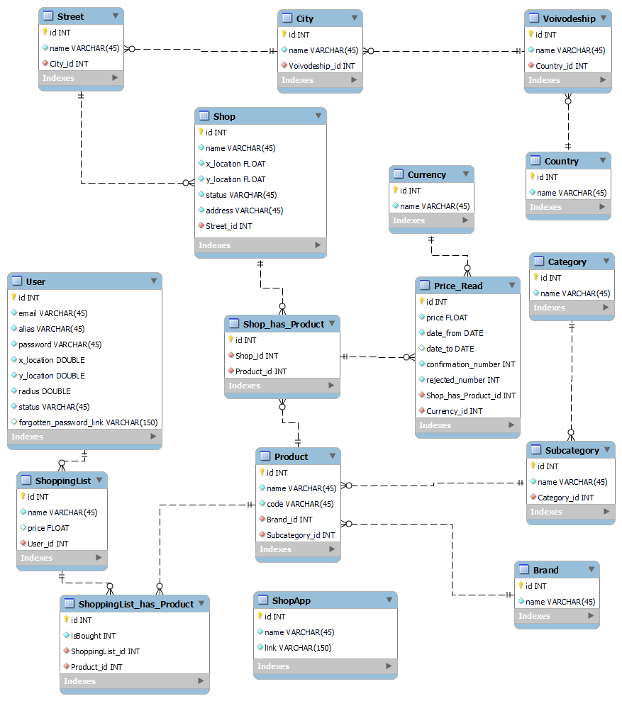
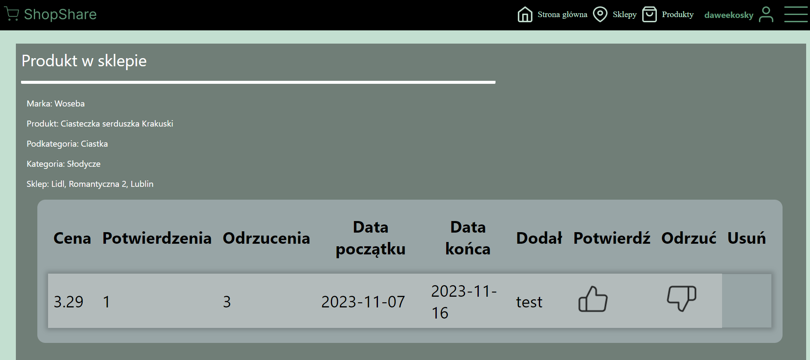
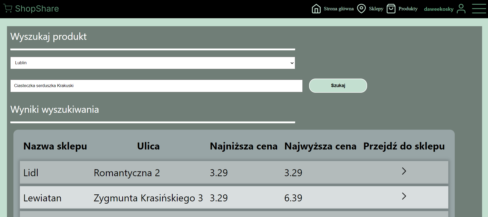
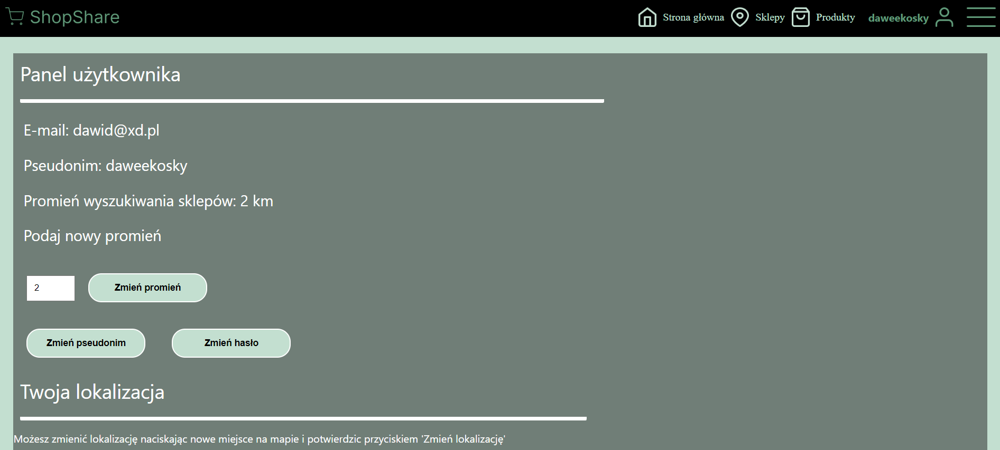

# Price Monitor

Engineering thesis: A system supporting monitoring prices in stationary stores

## About
A system supporting price monitoring in stationary stores nearby user’s localization. Users are able to add new shops, add prices for products or rate price correctness in specific shops. They can make their own shopping list and find in which nearby shop the list will be cheapest. There’s also an administrator panel to moderate data entered by users.

## Authors:
- [karolinaczapla10](https://github.com/karolinaczapla10)
- [project-cj](https://github.com/project-cj)
- [daweekosky](https://github.com/daweekosky)

### Needed tools
- Node Package Manager - 9.6.7
- local DB server - MySQL 8.2.0

### How to run 
1. Set up MysQL server and load database schema named "inz_db" from "inz_db_kod.sql" file in project
2. Access to the database is via the "root" user without a password
3. In the terminal, open the server folder and install all the necessary modules using the npm install command
4. In the terminal, open the client folder and install all the necessary modules using the npm install command
5. Start the server application in the server folder with the npm start command
6. Start the server application in the client folder with the npm start command

## Database schema
### Schema in SQL Workbench

## Screenshots from application

### Product in shop site

### Find a product site

### User panel site

